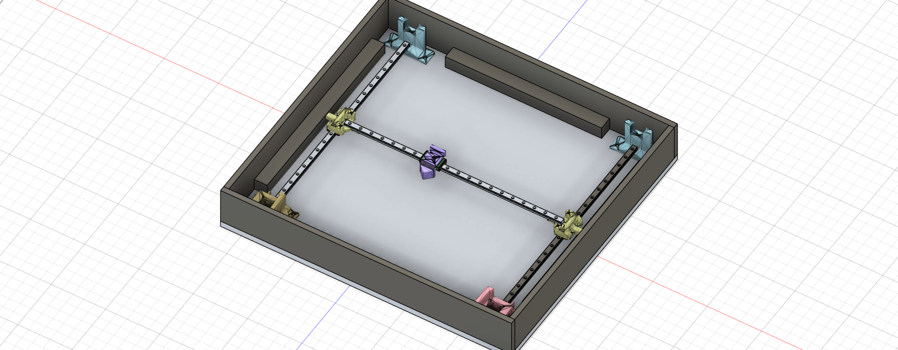

# 🎲 AI-Driven Robotic Backgammon

Welcome to the Robotic Backgammon project! This system combines custom mechanics, electronics, and computer vision to create an autonomous, smart game board.

## 🎯 Overview
The system relies on a hidden **CoreXY** motion mechanism located underneath the game board. The mechanism drives an electromagnet, which smoothly drags game pieces (equipped with an internal iron/magnet sandwich for absolute symmetry) across a 3mm transparent/frosted perspex board. Simultaneously, a camera and an AI vision model track player moves in real-time, allowing the software logic to react and move robotic pieces accordingly.

### 🌐 3D Interactive Model
[View the 3D model in your browser](https://a360.co/4yloJTi)

<p align="center">
  
  <br>
  <em>מבט על מכלול המערכת: מנגנון הנעה CoreXY נסתר מתחת ללוח המשחק</em>
</p>

## 🛠️ Architecture & Technologies
* **Mechanics & Framing:** CoreXY motion system, MGN12H linear rails, and high-strength GT2 timing belts. Custom 3D printed parts (game pieces, brackets, and CoreXY corners) are printed in PLA/PETG. The outer enclosure is built from wood.
* **Electronics & Actuation:** NEMA 17 stepper motors, silent TMC2209 stepper drivers, a 12V power supply, and a P25/20 electromagnet controlled via an external MOSFET module.
* **Communication & Firmware:** ESP32-S3 microcontroller (powered via an external USB-C panel mount), operating in Wi-Fi Access Point mode and supporting Over-The-Air (OTA) firmware updates.
* **Vision & AI:** An external PC or Jetson Nano running a YOLO vision model to detect piece positions, paired with a game logic engine.

## 🗺️ Roadmap & Work Plan (DAG)

```mermaid
graph TD
    classDef hardware fill:#ffdfba,stroke:#ffb347,stroke-width:2px,color:#000,rx:8,ry:8,font-weight:bold;
    classDef mech fill:#baffc9,stroke:#4caf50,stroke-width:2px,color:#000,rx:8,ry:8,font-weight:bold;
    classDef software fill:#bae1ff,stroke:#2196f3,stroke-width:2px,color:#000,rx:8,ry:8,font-weight:bold;
    classDef integration fill:#ffffba,stroke:#ffeb3b,stroke-width:2px,color:#000,rx:8,ry:8,font-weight:bold;
    
    subgraph Legend ["<b style='font-size:18px;'>📌 Legend - Color Code</b>"]
        direction LR
        L1["🔌 Hardware & Wiring"]:::hardware
        L2["⚙️ Mechanics & CAD"]:::mech
        L3["💻 Software & AI"]:::software
        L4["📦 Integration & Build"]:::integration
    end

    subgraph P1 ["<b style='font-size:20px;'>🚀 Phase 1: Procurement</b>"]
        A1["🛒 1. Initial Procurement"]:::hardware
    end

    subgraph P2 ["<b style='font-size:20px;'>⚙️ Phase 2: Core Mechanics & Prototyping</b>"]
        B1["🖨️ 2. Print CoreXY Parts"]:::mech
        B2["🪵 3. Mount on Temp Wood"]:::mech
        B3["⚡ 4. Wire & Test 1 Motor"]:::hardware
        B4["📏 5. Measure Actual Z-Gap"]:::mech
    end

    subgraph P3 ["<b style='font-size:20px;'>♟️ Phase 3: Game Pieces & Magnet</b>"]
        C1["🧲 6. Print 1 Piece & Test Drag"]:::mech
        C2["🎲 7. Print All Game Pieces"]:::mech
        C3["📐 8. Design Magnet Mount"]:::mech
    end

    subgraph P4 ["<b style='font-size:20px;'>🔌 Phase 4: Electronics & Firmware</b>"]
        D1["🔋 9. Full Wiring & MOSFET"]:::hardware
        D2["💻 10. ESP32 Motion Code"]:::software
        D3["📡 11. Setup ESP32 OTA"]:::software
    end

    subgraph P5 ["<b style='font-size:20px;'>🧠 Phase 5: Vision & Logic</b>"]
        E1["💬 12. Basic Comm: Direct Command"]:::software
        E2["👁️ 13. Train YOLO on Pieces"]:::software
        E3["📱 14. Build UI/App Display"]:::software
        E4["🤖 15. Backgammon Game Logic"]:::software
    end

    subgraph P6 ["<b style='font-size:20px;'>📦 Phase 6: Final Enclosure</b>"]
        F1["📐 16. Decide Final Dimensions"]:::integration
        F2["🪟 17. Order Perspex Board"]:::hardware
        F3["🪚 18. Build Wooden Box"]:::integration
        F4["🎉 19. Full System Integration"]:::integration
    end

    A1 --> B1
    A1 --> C1
    B1 --> B2
    B2 --> B3
    B3 --> B4
    C1 --> C2
    B4 --> C3
    B4 --> F1
    F1 --> F2
    F1 --> F3
    C3 --> D1
    B3 --> D1
    D1 --> D2
    D2 --> D3
    D2 --> E1
    C2 --> E2
    E2 --> E3
    E1 --> E4
    E2 --> E4
    D3 --> F4
    E4 --> F4
    F2 --> F4
    F3 --> F4
    
    style Legend fill:#ffffff,stroke:#333,stroke-width:2px,stroke-dasharray: 5 5,rx:10,ry:10
    style P1 fill:#f9f9f9,stroke:#ccc,stroke-width:3px,rx:10,ry:10
    style P2 fill:#f9f9f9,stroke:#ccc,stroke-width:3px,rx:10,ry:10
    style P3 fill:#f9f9f9,stroke:#ccc,stroke-width:3px,rx:10,ry:10
    style P4 fill:#f9f9f9,stroke:#ccc,stroke-width:3px,rx:10,ry:10
    style P5 fill:#f9f9f9,stroke:#ccc,stroke-width:3px,rx:10,ry:10
    style P6 fill:#f9f9f9,stroke:#ccc,stroke-width:3px,rx:10,ry:10
